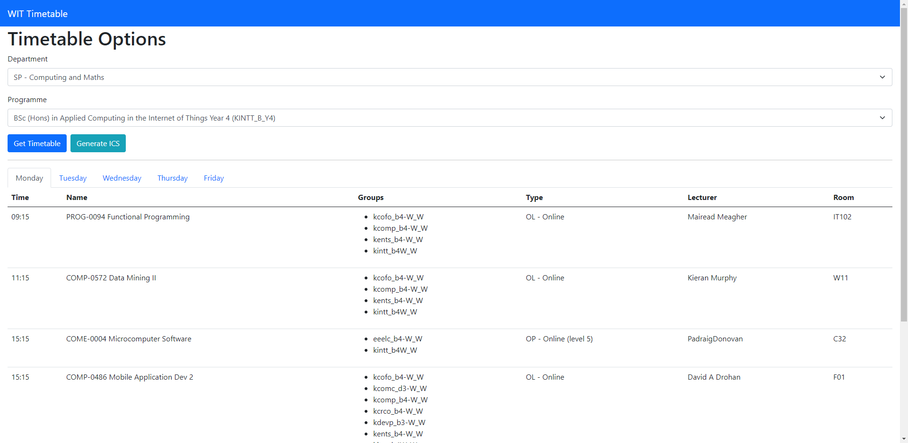

# WIT Timetable

A web scraper that reads information from the WIT Timetable website and displays it in a VueJS frontend.

Can create a .ical file that can be imported into a calender app/service such as Google Calendar.

This project is in no way affiliated with Waterford Institute of Technology.

## Screenshots

